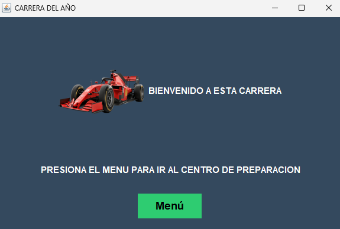
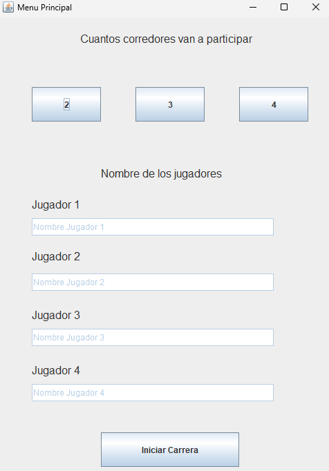
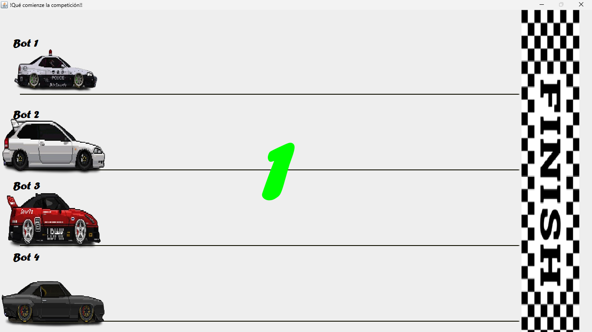
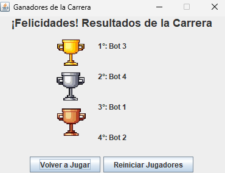

# Proyecto Hilos (threads) 🧵
# ¿Como funcionan?
Son proceso que se usan en segundo planos y pueden ser definidos con tiempo con la funcion Thread.sleep().

# Implementación
Hay dos forma de implementarlo:
````Java

public class Hilo extends Thread{
    @Override
    public void run() {
        //AQUI ESTARA EL PROCESO
    }
}

public class Hilo implements Runnable{
    @Override
    public void run() {
        //AQUI ESTARA EL PROCESO
    }
}
````

# Metodo más comunes
- void start(): usado para iniciar el cuerpo de la thread definido por el método run().

- void sleep(): pone a dormir una thread por un  tiempo mínimo especificado.

- void join(): usado para esperar por el término de la thread sobre la cual el método es invocado, por ejemplo por término de método run().

- void yield(): Mueve a la thread desde el estado de corriendo al final de la cola de procesos en espera por la CPU.

- boolean isAlive(): Retorna el valor 

# Como se usan los hilos en este proyecto
Se usaron en las clase de Auto y en el contador del juego:

- Contador
```java

private void contador() {
        JLabel n3 = new Etiqueta(String.valueOf(3), 550, 200, 600, 400, Color.RED, 200, "Forte").normal();
        n3.setVisible(false);
        panel.add(n3);
        panel.revalidate();
        panel.repaint();

        JLabel n2 = new Etiqueta(String.valueOf(2), 550, 200, 600, 400, Color.YELLOW, 200, "Forte").normal();
        n2.setVisible(false);
        panel.add(n2);

        JLabel n1 = new Etiqueta(String.valueOf(1), 600, 200, 600, 400, Color.GREEN, 200, "Forte").normal();
        n1.setVisible(false);
        panel.add(n1);

        JLabel vamos = new Etiqueta("GO!!", 430, 200, 600, 400, Color.BLACK, 200, "Forte").normal();
        vamos.setVisible(false);
        panel.add(vamos);

        JLabel banderin = new Etiqueta(620, 200, 600, 400, "img/banderin.png").conImagen();
        banderin.setVisible(false);
        panel.add(banderin);

        Thread hilo = new Thread(() -> {

            try {

                SwingUtilities.invokeLater(() -> n3.setVisible(true));
                Thread.sleep(2000); // 2 s
                SwingUtilities.invokeLater(() -> n3.setVisible(false));

                SwingUtilities.invokeLater(() -> n2.setVisible(true));
                Thread.sleep(1000); // 1 s
                SwingUtilities.invokeLater(() -> n2.setVisible(false));

                SwingUtilities.invokeLater(() -> n1.setVisible(true));
                Thread.sleep(1000); // 1 s
                SwingUtilities.invokeLater(() -> n1.setVisible(false));

                SwingUtilities.invokeLater(() -> vamos.setVisible(true));
                SwingUtilities.invokeLater(() -> banderin.setVisible(true));
                Thread.sleep(2000); // 2 s
                SwingUtilities.invokeLater(() -> vamos.setVisible(false));
                SwingUtilities.invokeLater(() -> banderin.setVisible(false));

            } catch (InterruptedException e) {
            }
        });

        hilo.start();
    }
```

- Auto

```java
public class Auto extends Thread{

    
    private JLabel auto;
    private int meta;
    private String nombre;
    
    public Auto(String nombre,JLabel auto, int meta){
        this.nombre=nombre;
        this.auto=auto;
        this.meta=meta;
    }

   @Override
    public void run(){
        try { Thread.sleep(5900); } catch (InterruptedException e) {}

        while (auto.getX() < meta) {
            int avance = (int)(Math.random() * 10 + 1); // MUEVE ALEATORIAMANTE

            SwingUtilities.invokeLater(() -> auto.setLocation(auto.getX() + avance, auto.getY()));

            try { Thread.sleep(50); } catch (InterruptedException e) {}
        }

        synchronized (Carrera.ganadores) {
            Carrera.ganadores.add(nombre);
        }
    }
````

# Imagenes del proyecto 🖨️💻


Ventana Bienvenida




Menu




Pantalla de carrera




Resultado de la carrera

